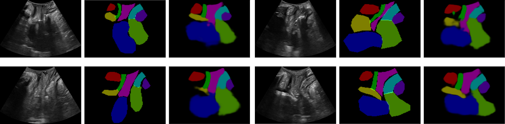

# PFUS1: Premier Pelvic Floor Ultrasound Segmentation Dataset. A Resource for Advancing Research.

  

This repository contains the source code to reproduce the experiments carried out with the publication of PFUS1, the first Pelvic Floor Ultrasound Segmentation dataset. The aim of these experiments is to validate the quality of the dataset for performing segmentation tasks.

An FPN network with a ResNet50 backbone was used to recognize nine different organs from ultrasound images. A cross-validation strategy with 5 folds was used during training. The training progress is shown in the following animation:

  

## Usage

After cloning the project, you need to install the dependencies specified in the *requirements.txt* file.

```commandline
pip install -r requirements.txt
```

Once the requirements are installed, you can execute the *train.py* command:

```commandline
python train.py
```

## Dataset

The dataset needs to be downloaded and extracted inside the project directory. The dataset is available in the Zenodo repository and can be accessed via the link [https://doi.org/10.5281/zenodo.10800787](https://doi.org/10.5281/zenodo.10800787). It was released under a Creative Commons Attribution (CC BY) license. The dataset is structured as follows: at the top level, there is a directory named "data" containing 110 folders, each corresponding to a patient, named "PXXX", where XXX is the patient identifier (from 000 to 109).

Each patient folder contains two files per image frame: a PNG file with the ultrasound image and a JSON file with the segmentation polygons. Each file is named "frame\_YYY\.png" or "frame\_YYY\.json" respectively, where YYY is the video frame number.

Each JSON file with the segmentation polygons is structured as a list of eight dictionaries. Each dictionary has two keys: "label" and "pol". The "label" key identifies the organ with a string, and the "pol" key is a list of pairs (x, y) defining the points list of the polygon. An example of a JSON file is shown below:


```json
    [
      { 
        "pol": [[800, 400], [848, 320], ...., [796, 401]],
        "label": "Levator ani muscle"
      },
      { 
        "pol": [[750, 371], [794, 384], ...., [726, 426]],
        "label": "Rectum"
      },
      ...
      ...
      ...

    ]
``` 

If you want to use this dataset in your project, you can utilize the `read_image_and_masks` function found in `utils.py`. This function reads an ultrasound image and creates mask segmentation images for each organ from the corresponding JSON file.
## Acknowledgments

This work has been supported by Proyecto PID2019-109152GB-I00 financiado por MCIN/ AEI /10.13039/501100011033 (Agencia Estatal de Investigación), Spain and by the Ministry of Science.

## Citation

Pending...

---